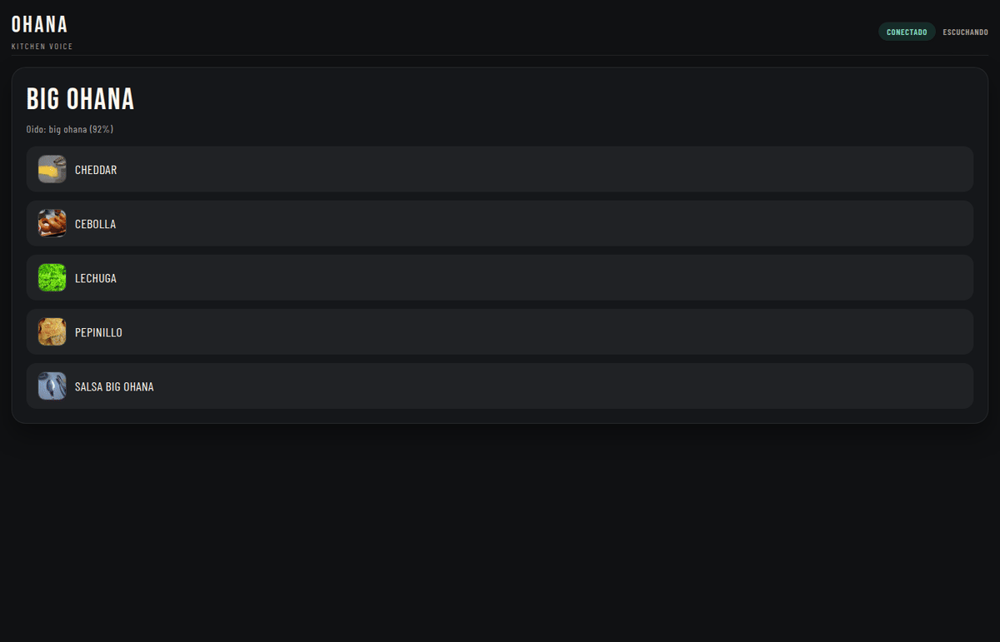

# Ohana Kitchen Voice MVP


**Offline-first voice ordering for QSR kitchens**

Voice-activated order entry that works in noisy environments without cloud dependencies. Human validation before sending to kitchen display.



---

## ⚡ Quick Start (Browser Demo — No Install)

**See the UI immediately** (no backend needed):

```bash
git clone https://github.com/albertquerol12345/ohana-voice.git
cd ohana-voice
python -m http.server 8080 --directory frontend
```

Open: `http://localhost:8080/?demo=1`

✅ Browse the 19-item catalog  
✅ See the kitchen order flow  
✅ No microphone setup required

> Nota: el **demo en navegador** es solo UI. El reconocimiento de voz requiere el backend local.

---

## 🎯 The Problem

Kitchen staff need hands-free order entry. Existing solutions:
- ❌ Require quiet environments (cloud ASR fails with grill noise)
- ❌ No validation step (errors go straight to kitchen)
- ❌ Expensive monthly SaaS fees

**Ohana approach:**
- ✅ Local ASR (Vosk/Kaldi) works offline
- ✅ Human validation before sending
- ✅ One-time setup, zero recurring costs

---

## 📊 Demo Scale

| Metric | Value |
|--------|-------|
| Catalog items | 19 burgers (ver `frontend/data/burgers.json`) |
| ASR modes | 3 (Vosk grammar, Whisper streaming, DTW voice-trained) |
| Offline capable | ✅ Yes |
| Browser demo | ✅ Works without backend |

---

## 🚀 Full Setup (With Voice)

```bash
# 1. Install
python3 -m venv .venv
source .venv/bin/activate
pip install -r backend/requirements.txt

# 2. Download Spanish model (~40MB)
curl -L -o vosk-model-small-es-0.42.zip https://alphacephei.com/vosk/models/vosk-model-small-es-0.42.zip
unzip -q vosk-model-small-es-0.42.zip

# 3. Run
.venv/bin/python backend/server.py
```

Open: `http://localhost:8000`

---

## 🏗️ Architecture

```
┌─────────────┐     ┌─────────────┐     ┌─────────────┐     ┌─────────────┐
│   Voice     │  →  │    ASR      │  →  │  Validation │  →  │   Kitchen   │
│   Input     │     │   Engine    │     │    UI       │     │   Display   │
│  (microphone)│    │(offline)    │     │(human OK)   │     │  (orders)   │
└─────────────┘     └─────────────┘     └─────────────┘     └─────────────┘
```

**ASR Modes:**
1. **Vosk Grammar** — Fastest, no training needed, limited vocabulary
2. **Whisper Streaming** — Best accuracy, requires GPU/cloud
3. **DTW Voice-trained** — Personalized to your voice, no cloud

---

## 📁 Project Structure

```
ohana-voice/
├── assets/             # Preview GIFs
├── frontend/           # Static UI (HTML/CSS/JS)
│   ├── data/
│   │   └── burgers.json      # 19-item catalog
│   └── assets/
│       └── (icons/ingredients)
├── backend/
│   ├── server.py             # Vosk grammar mode
│   ├── app.py                # Whisper streaming
│   ├── dtw_server.py         # Voice-trained mode
│   └── keywords.json         # Voice command aliases
└── README_FULL.md            # Detailed technical docs
```

---

## 🎓 Use Cases

- **QSR Kitchens** — Hands-free order entry during rush
- **Food Trucks** — No internet required
- **Accessibility** — Voice control for POS systems

---

## 📚 Documentation

- [DEMO.md](DEMO.md) — Step-by-step walkthrough with screenshots
- [README_FULL.md](README_FULL.md) — All 5 ASR modes, tuning parameters, training workflows
- [frontend/data/burgers.json](frontend/data/burgers.json) — Catalog structure

---

## 🛠️ Tech Stack

**ASR:** Vosk/Kaldi · Whisper (faster-whisper) · DTW (dynamic time warping)  
**Backend:** Python · websockets  
**Frontend:** Vanilla JS · HTML5 · CSS3  
**Audio:** WebRTC (browser) · VAD (webrtcvad)
