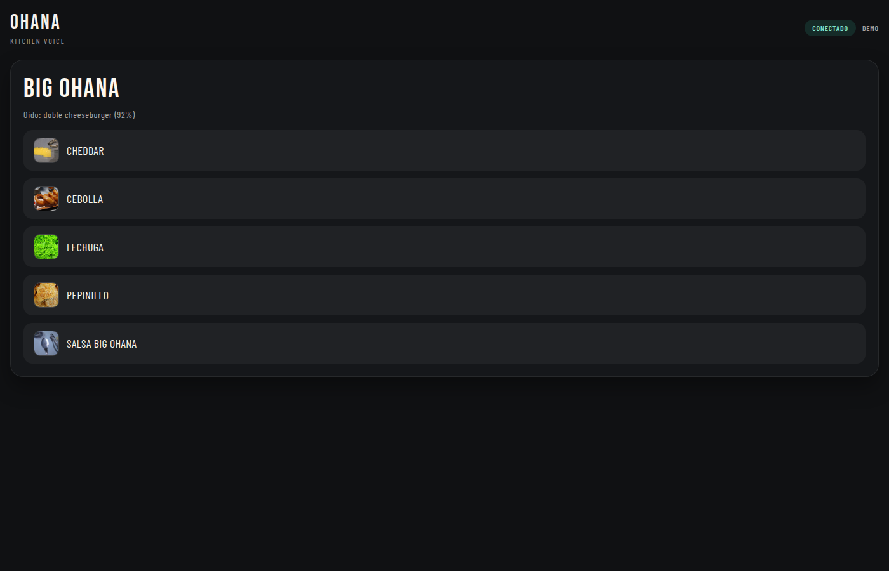

# Ohana Voice — Technical Demonstration


**A technical demonstration of offline voice recognition for noisy environments.**

This is not a commercial POS system. It is a **sandbox** exploring:
- Offline ASR (no cloud dependencies)
- Voice activity detection in noisy environments
- Human-in-the-loop validation before order confirmation
- Real-time audio processing patterns

> **For recruiters/reviewers:** See [What to Evaluate](#what-to-evaluate) section below.

---

## 🎯 The Core Demonstration

**Problem:** Cloud-based voice ordering fails in noisy QSR kitchens (grills, fryers, conversations).  
**Approach:** Local ASR with constrained grammar + human validation step.  
**Demonstration:** Browser-based UI showing the flow (voice or simulated).

```
Voice Input → VAD → ASR (Vosk) → Keyword Matching → 
→ Validation UI → Kitchen Display
   (offline)       (human confirms)
```

---

## ⚡ Quick Start (Browser Demo)

**No installation needed** — See the UI immediately:

```bash
git clone https://github.com/albertquerol12345/ohana-voice.git
cd ohana_voice_mvp
python -m http.server 8080 --directory frontend
```

Open: `http://localhost:8080/?demo=1`

### What You'll See:
- **Menu Grid:** 19-item catalog (burgers, sides, drinks)
- **Order Builder:** Visual feedback as items are added
- **Validation Step:** Human confirmation before sending
- **Kitchen Display:** Final order presentation

> **Note:** The `?demo=1` flag disables microphone requirements. Click buttons to simulate voice commands.

---

## 🎙️ Full Voice Demo (Requires Setup)

```bash
# Setup
python3 -m venv .venv
source .venv/bin/activate
pip install -r backend/requirements.txt

# Download Spanish ASR model (~40MB)
curl -L -o vosk-model-small-es-0.42.zip \
  https://alphacephei.com/vosk/models/vosk-model-small-es-0.42.zip
unzip -q vosk-model-small-es-0.42.zip

# Run backend
.venv/bin/python backend/server.py
```

Open: `http://localhost:8000`

### Voice Commands to Try:
| Command | Result |
|---------|--------|
| "Doble cheese" | Adds Double Cheese Burger |
| "Con bacon" | Adds bacon modifier |
| "Sin cebolla" | Removes onion |
| "Coca cola grande" | Adds Large Coke |
| "Enviar pedido" | Opens validation modal |

---

## 📸 What It Actually Looks Like

### The UI Flow


*Main interface: Menu grid on left, current order on right*

**Screens:**
1. **Menu Grid** — Visual catalog with images
2. **Voice Status** — Live feedback ("Listening...", "Detected: Doble Cheese")
3. **Order Builder** — Current items with modifiers
4. **Validation Modal** — Human confirms before sending
5. **Kitchen Display** — Ticket format for kitchen staff

---

## 🔍 What to Evaluate

**If you're a technical reviewer, focus on:**

| Aspect | Where to Look | What Demonstrates |
|--------|---------------|-------------------|
| **ASR Integration** | `backend/kaldi_server.py` | Vosk/Kaldi offline integration |
| **Voice Detection** | `backend/vad_*.py` | Voice Activity Detection tuning |
| **Pattern Matching** | `backend/keywords.json` | Fuzzy matching for voice commands |
| **Real-time Audio** | `backend/audio_*.py` | WebSocket audio streaming |
| **UI State Mgmt** | `frontend/app.js` | Vanilla JS state management |

**Architecture highlights:**
- **Grammar-constrained ASR:** Limited vocabulary = higher accuracy
- **VAD (Voice Activity Detection):** Distinguishes speech from kitchen noise
- **HITL Pattern:** Voice → Suggestion → Human confirms → Action

**Don't evaluate:**
- ❌ Commercial readiness (it's a prototype)
- ❌ ASR accuracy vs cloud solutions (trade-off by design)
- ❌ Payment integration (out of scope)

---

## 🏗️ Technical Architecture

### ASR Modes Demonstrated

1. **Vosk Grammar Mode** (default)
   - Fast, no training needed
   - Runtime grammar switching
   - Best for controlled vocabularies

2. **Whisper Streaming** (optional)
   - Higher accuracy
   - Requires GPU/cloud
   - Fallback for complex phrases

3. **DTW Voice-Trained** (optional)
   - Personalized to speaker
   - No cloud dependencies
   - Requires 15min training

### Key Technical Challenges Addressed

1. **Noisy Environment**
   - VAD with configurable aggressiveness
   - Auto-gain control for low-volume speech
   - Hysteresis to prevent false triggers

2. **Offline-First**
   - All ASR runs locally (Vosk/Kaldi)
   - No internet required after setup
   - Works in basements, food trucks, etc.

3. **Hands-Free Operation**
   - No push-to-talk button
   - Continuous listening with cooldown periods
   - Visual feedback only (no audio prompts)

---

## 📊 Demo Scale Reality Check

| Metric | Value | Context |
|--------|-------|---------|
| Catalog size | 19 items | Burgers, sides, drinks, combos |
| ASR models | 2 options | Small (~40MB) or Large (~1.4GB) |
| Recognition | ~80-90% | Clean speech; drops in noise |
| Latency | ~1-2s | End-to-end voice → UI update |

**Limitations (by design):**
- Limited to catalog items (no open vocabulary)
- Single-language (Spanish)
- Requires quiet environment for best results

---

## 🛠️ Stack & Patterns

**Backend:**
- Python + FastAPI
- WebSocket for real-time audio
- Vosk/Kaldi for offline ASR

**Frontend:**
- Vanilla JavaScript (no frameworks)
- WebRTC for microphone access
- CSS Grid for responsive layout

**Patterns:**
- Event-driven architecture
- State machine for order flow
- Command pattern for voice actions

---

## 💡 Why This Exists

I built Ohana to demonstrate:
1. **Offline-first architecture** — Critical for environments with poor connectivity
2. **Real-time audio processing** — WebSocket streaming, VAD, buffering
3. **UX for high-pressure environments** — Kitchen staff need hands-free, eyes-free operation
4. **Trade-off analysis** — Accuracy vs latency vs cost vs privacy

It's not a commercial POS. It's a **technical exploration** of voice interfaces in challenging environments.

---

## 📚 Documentation

- [README_FULL.md](README_FULL.md) — Complete setup and ASR modes
- [DEMO.md](DEMO.md) — Step-by-step walkthrough
- `frontend/data/burgers.json` — Catalog structure

---

*Questions about the audio processing? Open an issue or email: albert.querol.beltran@gmail.com*
